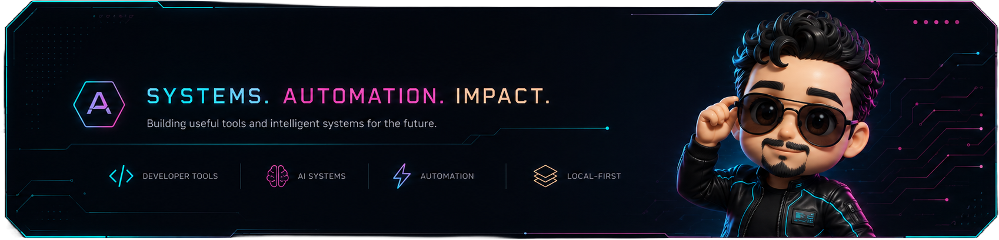
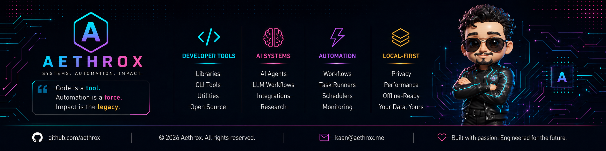

  

<h1 align="center">AETHROX</h1>

  Building useful systems with AI and automation.

  <a href="https://aethrox.me">Website</a>
  ·
  <a href="https://github.com/aethrox">GitHub</a>
  ·
  <a href="mailto:kaan@aethrox.me">Contact</a>

<h2>Overview</h2>

I build AI infrastructure, automation tools, developer utilities, and
local-first software.

My focus is creating systems that remain reliable, inspectable, and under
human control.

<blockquote>
The goal is not to make AI appear autonomous. 
</blockquote>

<h2>Selected Work</h2>

<table>
<tr>
<td width="50%">

<h3>Browtrace</h3>

Browser connection observability with Rust and eBPF.

<a href="https://github.com/aethrox/browtrace">
View Project →
</a>

</td>

<td width="50%">

<h3>CleanSys</h3>

Review-first digital cleanup with explicit approval.

<a href="https://github.com/aethrox/cleansys">
View Project →
</a>

</td>
</tr>

<tr>
<td>

<h3>Klaro</h3>

Autonomous documentation generation.

<a href="https://github.com/aethrox/klaro">
View Project →
</a>

</td>

<td>

<h3>KeenCLI</h3>

Keenetic diagnostics and log analysis.

<a href="https://github.com/aethrox/keencli">
View Project →
</a>

</td>
</tr>
</table>

<h2>Focus</h2>

<code>AI SYSTEMS</code>
<code>AUTOMATION</code>
<code>LOCAL-FIRST</code>
<code>DEVELOPER TOOLS</code>

 

  

