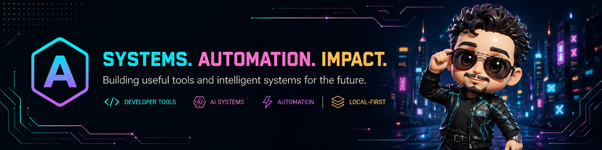
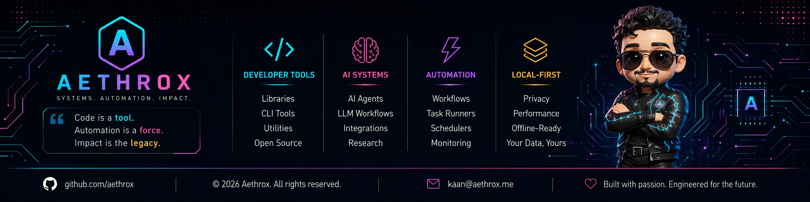

  

  <a href="https://aethrox.me">Website</a>
  ·
  <a href="https://github.com/aethrox">GitHub</a>
  ·
  <a href="mailto:kaandemirel@aethrox.me">Contact</a>

  
  
  
  
  
  
  
  
  
  
  
  
  
  

<h2>Overview</h2>

I build small, composable tools instead of one big platform: CLIs, agents,
and infrastructure that do one job well and stay debuggable when they fail.

Most of what I ship touches AI in some way, but the AI is a component, not
the point: it drafts, suggests, and automates, while every consequential
action still passes through an explicit approval step.

I run everything self-hosted where I can (Podman, systemd)
because I'd rather own my failure modes than rent them.

<blockquote>
The goal is not to make AI appear autonomous.
</blockquote>

<h3>Now</h3>

<ul>
<li><a href="https://github.com/aethrox/doctrine">doctrine</a> — engineering discipline (OWASP, ITIL, IETF RFCs, ISO, SBAR) shipped as a Claude Code plugin and MCP server</li>
<li><a href="https://github.com/aethrox/shodan-mcp">shodan-mcp</a> — MCP server for scanning your own infrastructure and searching Shodan's internet-wide data</li>
<li><a href="https://github.com/aethrox/browtrace">browtrace</a> — Rust + eBPF CLI that observes outbound TCP connections opened by browser processes on Linux</li>
</ul>

 

  

